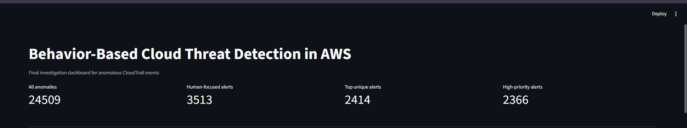
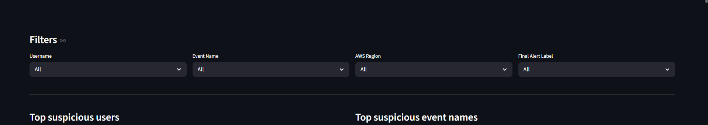
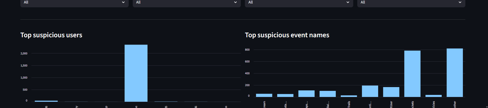
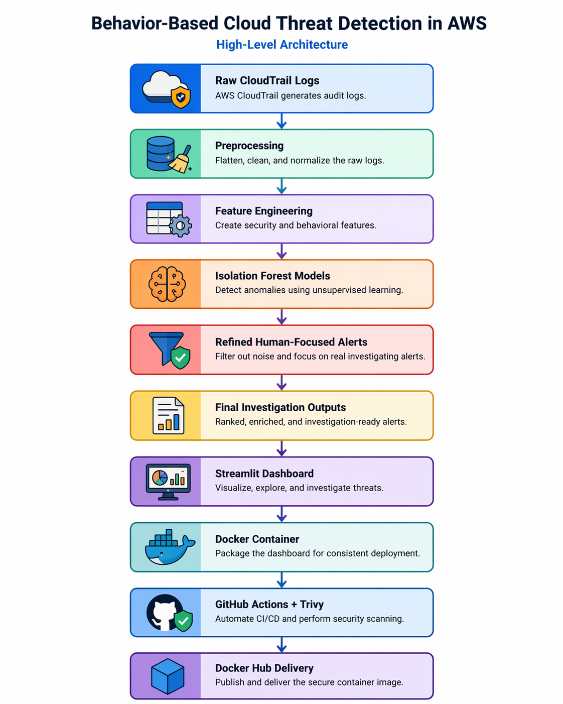

# Behavior-Based Cloud Threat Detection in AWS using Machine Learning


A cloud security and machine learning project that analyzes AWS CloudTrail logs to detect anomalous behavior, generate refined human-focused alerts, and visualize suspicious activities through an interactive Streamlit dashboard.

The project also includes a DevSecOps layer with Docker, GitHub Actions CI/CD, Trivy security scanning, and Docker Hub image publishing.

---

## Overview

Cloud environments generate a massive number of audit events every day.  
Although these logs contain valuable security signals, manual review is difficult, time-consuming, and not scalable.

This project addresses that challenge by building a behavior-based anomaly detection pipeline for AWS CloudTrail logs. It transforms raw semi-structured log data into investigation-ready alerts and presents the results through a dashboard designed for cloud security analysis.

---

## Repository Scope

This repository contains the **runtime / portfolio version** of the project.

It includes:
- the Streamlit dashboard
- final investigation outputs
- Docker and CI/CD files
- documentation and security notes

To keep the repository lightweight and compatible with GitHub size limits, the large raw dataset and intermediate processing files are not included in this version of the repository.

As a result, the repository is intended for:
- dashboard execution
- result inspection
- Docker-based usage
- CI/CD demonstration

It is not intended to rerun the full preprocessing and model training pipeline without restoring the archived raw and intermediate data.

---

## Key Features

- AWS CloudTrail log preprocessing and cleaning
- Security and behavior-based feature engineering
- Unsupervised anomaly detection using Isolation Forest
- Human-focused alert refinement to reduce automation noise
- Streamlit dashboard for investigation and visualization
- Dockerized dashboard deployment
- GitHub Actions CI/CD pipeline
- Trivy security scanning
- Docker Hub image publishing

---

## Dataset

This project uses the **flaws.cloud CloudTrail dataset**, a public AWS CloudTrail dataset collected from a realistic cloud environment.

### Main fields used
- `eventTime`
- `eventName`
- `eventSource`
- `sourceIPAddress`
- `awsRegion`
- `userIdentity`
- `mfaAuthenticated`
- `errorCode`

> Large raw and intermediate datasets are excluded from Git tracking because of GitHub size limits.  
> The current GitHub version focuses on final outputs, dashboard delivery, and DevSecOps integration.

---

## Methodology

### 1. Preprocessing
Raw CloudTrail JSON logs are:
- flattened into tabular format
- cleaned and normalized
- converted into CSV files for analysis

### 2. Feature Engineering
Two categories of features are used.

**Security features**
- root activity
- MFA status
- AccessDenied events
- source IP and region clues

**Behavioral features**
- rare event for a user
- rare IP for a user
- rare region for a user
- unusual activity hour
- user activity frequency patterns

### 3. Anomaly Detection
The project uses **Isolation Forest**, an unsupervised anomaly detection model that does not require labeled attack data.

### 4. Alert Refinement
A refinement layer is applied to:
- reduce AWS internal automation noise
- separate human activity from service-generated activity
- produce more meaningful investigation alerts

### 5. Visualization
A Streamlit dashboard is used to explore and investigate the final suspicious events.

---

## Pipeline

```text
Raw CloudTrail Logs
        ↓
Flattening and Cleaning
        ↓
Feature Engineering
        ↓
Baseline Anomaly Detection
        ↓
Behavior-Based Anomaly Detection
        ↓
Refined Human-Focused Alert Filtering
        ↓
Final Investigation Alerts
        ↓
Streamlit Dashboard
```

---

## DevSecOps Workflow

```text
Source Code
   ↓
GitHub Repository
   ↓
GitHub Actions CI/CD
   ↓
Python Checks
   ↓
Docker Image Build
   ↓
Trivy Security Scan
   ↓
Docker Hub Publish
   ↓
Run Dashboard from Docker Image
```

---

## Current Results

Final outputs from the refined pipeline:

- **All anomalies:** 24,509
- **Human-focused alerts:** 3,513
- **Top unique alerts:** 2,414
- **High-priority alerts:** 2,366

These results represent the final investigation-ready output after preprocessing, anomaly detection, refinement, and filtering.

---

## Screenshots

### Dashboard Overview


### Investigation Filters and Charts


### Suspicious Activity Charts


---

## Dashboard

The dashboard provides:

- summary metrics
- user, event, region, and alert-level filters
- top suspicious users
- top suspicious event types
- top suspicious source IPs
- top suspicious AWS regions
- final ranked investigation alerts

It is designed to make anomaly detection results easier to understand and more useful for cloud security investigation.

---

## Architecture



For more details, see [docs/architecture.md](docs/architecture.md).

---

## Threat Model

This project is mainly intended to help detect:
- privileged misuse
- account compromise indicators
- suspicious API behavior
- reconnaissance and enumeration patterns

For more details, see [docs/threat-model.md](docs/threat-model.md).

---

## Project Structure

```text
cloud-threat-detection/
│
├── app/
│   └── streamlit_app.py
│
├── data/
│   └── final_outputs/
│       ├── final_all_anomalies.csv
│       ├── final_human_alerts.csv
│       └── final_top_alerts.csv
│
├── docs/
│   ├── architecture.md
│   ├── threat-model.md
│   ├── architecture-diagram.png
│   └── images/
│
├── infra/
│   └── docker/
│       └── Dockerfile
│
├── pipelines/
│   ├── run_dashboard.ps1
│   ├── run_dashboard_docker.ps1
│   └── run_finalize_alerts.ps1
│
├── scripts/
│   ├── analysis/
│   ├── modeling/
│   └── preprocessing/
│
├── security/
│   └── security-notes.md
│
├── tests/
│   └── test_dashboard_smoke.py
│
├── .github/
│   └── workflows/
│       └── ci.yml
│
├── .dockerignore
├── .gitignore
├── requirements.txt
└── README.md
```

---

## Main Components

### Active in this repository version
- `app/streamlit_app.py`
- `infra/docker/Dockerfile`
- `.github/workflows/ci.yml`
- `data/final_outputs/`

### Included project scripts
The repository also contains the original preprocessing, modeling, and analysis scripts under `scripts/` for project completeness and reference.

> Note: these scripts may require archived raw/intermediate data to run again end-to-end.

---

## Local Setup

### Install dependencies
```bash
python -m pip install -r requirements.txt
```

### Run the dashboard
```bash
python -m streamlit run .\app\streamlit_app.py
```

### Run with Docker
```bash
docker build -f .\infra\docker\Dockerfile -t cloud-threat-detection-dashboard .
docker run --rm -p 8501:8501 cloud-threat-detection-dashboard
```

### Important note
The current repository version is optimized for:
- dashboard execution
- final alert inspection
- Docker usage
- CI/CD demonstration

The full preprocessing, feature engineering, and model training pipeline requires archived raw and intermediate data that are not included in this lightweight GitHub version.

---

## Docker Hub

### Pull the published image
```bash
docker pull abdelazez1/cloud-threat-detection:latest
```

### Run directly from Docker Hub
```bash
docker run --rm -p 8501:8501 abdelazez1/cloud-threat-detection:latest
```

---

## CI/CD

The GitHub Actions pipeline performs:

- dependency installation
- Python smoke checks
- final dashboard data validation
- Docker image build
- Trivy filesystem scan
- Trivy image scan
- Docker Hub image publishing

This allows the project to be automatically built, scanned, and delivered after code changes.

---

## Security Scanning

Security checks are integrated using **Trivy**.

Current scans include:
- filesystem scan
- container image scan

This helps identify:
- high and critical vulnerabilities
- insecure dependencies
- container-related risks

---

## Tech Stack

- Python
- Pandas
- Scikit-learn
- Streamlit
- AWS CloudTrail
- Isolation Forest
- Docker
- GitHub Actions
- Trivy
- Docker Hub

---

## References

- AWS CloudTrail Documentation
- flaws.cloud public CloudTrail dataset
- Scikit-learn Isolation Forest documentation
- AWS GuardDuty documentation
- Recent anomaly detection and log analysis research

---

## Future Improvements

- further reduce false positives
- improve separation between human and automation activity
- add real-time alerting
- deploy the dashboard to a cloud environment
- compare additional anomaly detection models
- expand DevSecOps checks and policy validation

---

## Conclusion

This project demonstrates how behavior-based anomaly detection can be used to identify suspicious cloud activities from AWS CloudTrail logs.

By combining preprocessing, feature engineering, anomaly detection, alert refinement, dashboard visualization, Docker containerization, CI/CD automation, and security scanning, the project provides a practical and extensible cloud threat detection workflow.

This GitHub version is focused on reproducibility, dashboard delivery, and DevSecOps integration, while the full training workflow depends on archived large datasets and intermediate files.
